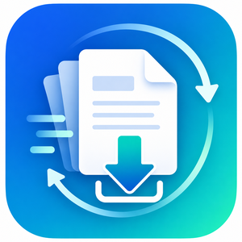

<div align="center">

  
  <h1>Freepaper</h1>
  <p>Open-source academic PDF downloader for Microsoft Edge and Google Chrome.</p>
  <p><strong>English</strong> · <a href="README.zh-CN.md">简体中文</a></p>
</div>

> **v2.0.5 CHNDOI multi-target resolver hotfix:** Chinese DOI routes that land on `chndoi.org/Resolution/Handler` are no longer mistaken for article pages. Freepaper selects the appropriate CNKI target (preferring the domestic `link.cnki.net` route), continues to the real article/CNKI page, then enters the normal recoverable login/auth/PDF workflow.

Current version: **v2.0.5**

> Freepaper helps users download content they are authorized to access. It does not bypass paywalls, institutional permissions, security verification, or website technical measures.

> **Experimental CNKI support:** Freepaper only uses PDF/download routes already exposed by CNKI or CNKI-supported journal pages. It does not bypass authentication, institutional access, CAPTCHAs, or paywalls.

## Features

- Detect PDF candidates on the current paper page;
- Import DOI/URL tasks from pasted text, CSV, TSV, or TXT;
- Deduplicate by DOI, arXiv ID, ScienceDirect PII, and other identifiers;
- Save PDFs under a configurable subfolder of the browser Downloads directory;
- Try one clearly identified PDF link or button, without blindly clicking ads, purchase routes, icons, or static assets;
- Pause for sign-in or verification, then resume the PDF flow;
- Prefer authenticated article-page PDF retrieval and save the verified Blob into the Freepaper folder;
- Reconcile browser download events associated with the active task;
- Recover state after Manifest V3 service-worker suspension;
- Provide a popup control center, one reusable task-monitor window, and a draggable page assistant;
- Pause, resume, skip, stop, and retry failed/login-required papers;
- Embed a downloadable and copyable example CSV;
- Export a basic CSV result report;
- Support English, Simplified Chinese, and Auto language selection.

## Why Freepaper works this way

1. **Input order is preserved.** Papers are not regrouped by publisher because concentrating one publisher's items may create a denser burst of requests.
2. **The queue is serial.** Only one paper is processed at a time in the same browser.
3. **Only clear PDF actions are automated.** Freepaper uses metadata, strict PDF routes, or a clear View PDF / Download PDF control and tries it once per page state.
4. **Verification remains human.** CAPTCHAs and institutional authentication are never automated or bypassed.
5. **Confirmed PDFs are saved by Freepaper.** This keeps files in the configured subfolder and aligns the task count with actual downloads.
6. **Dynamic PDF endpoints are not re-requested by the downloads API.** IEEE, Wiley, ScienceDirect, and CNKI routes may depend on the current page Referrer, cookies, institutional authentication, or one-time tokens. v2.0.2 fetches and verifies the PDF in the authenticated article page and starts a Blob download there, preventing HTML challenge pages from being saved as PDF downloads.

Do not use Freepaper for systematic full-text harvesting, whole issues/volumes, or any use that violates publisher or institutional rules.

## Browser compatibility

- Microsoft Edge 88 or later;
- Google Chrome 88 or later.

The same Chromium Manifest V3 runtime package can be tested on both browsers.

## Install locally

1. Download or clone the repository;
2. Open `edge://extensions` or `chrome://extensions`;
3. Enable Developer mode;
4. Choose Load unpacked;
5. Select the directory that directly contains `manifest.json`.

## Usage

### Batch flow

```text
Article page
→ Freepaper tries one clear PDF action
→ Login/verification pauses the task
→ The user completes the required action
→ Freepaper resumes detection
→ Authenticated article-page PDF verification and Blob download
→ If page-context saving is blocked, wait for the viewer download event
→ Task result and count update
```

If no sufficiently clear PDF action exists, the page assistant asks the user to take over. CAPTCHAs, publisher-account sign-in, and institutional authentication must be completed by the user.

A shared state machine now distinguishes article pages, clear PDF actions, institutional authentication, publisher-account login, human verification, purchase/access-denied pages, PDF viewers, and browser downloads. Publisher adapters only identify site-specific pages and PDF controls.

### Example CSV

The onboarding and quick-start panels include an embedded sample that can be downloaded or copied. CSV, TSV, and TXT are supported; XLSX is not imported directly.

## Privacy

Freepaper does not upload paper lists, browsing history, authentication information, or download history to a developer-operated server. It contains no analytics, advertising, or tracking SDK. See [privacy-policy.md](privacy-policy.md).

## Permissions

| Permission | Purpose |
|---|---|
| `downloads` | Start and track Freepaper or explicitly associated PDF downloads |
| `storage` | Store settings, queues, recovery state, and local history |
| `activeTab` | Scan the current page after user action |
| `tabs` | Open and bind paper/task tabs |
| `scripting` | Detect PDF links, clear PDF actions, and page state |
| `webNavigation` | Track redirects, verification pages, and PDF transitions |
| `alarms` | Recover unfinished work after service-worker suspension |
| `<all_urls>` | Support user-selected DOI, publisher, and PDF domains |

## Development and validation

```bash
npm run verify
```

- Code audit and fix notes: [`docs/CODE_AUDIT_v2.0.2_ZH.md`](docs/CODE_AUDIT_v2.0.2_ZH.md)
- Validation plan: [`docs/VALIDATION_v2.0.2_ZH.md`](docs/VALIDATION_v2.0.2_ZH.md)
- Regression CSV: [`examples/regression-page-context-v2.0.2.csv`](examples/regression-page-context-v2.0.2.csv)
- Store documents: [`docs/store/`](docs/store/)

## Known limitations

- Publishers may require institutional credentials, VPN access, or manual verification;
- Freepaper cannot retrieve content the user is not authorized to access;
- Publisher page structures can change;
- The downloads API saves under the browser Downloads directory;
- A browser download that has already completed before Freepaper can identify it cannot be moved afterward. v2.0.2 enters the task-scoped waiting state before page-context downloads are triggered, so `onDeterminingFilename` can place them in the Freepaper subfolder.
- Built-in PDF viewer toolbars cannot always be controlled by extensions. If a publisher also blocks page-context fetching, Freepaper stops automatic re-requests and waits for the user to use the viewer download button rather than saving an HTML challenge page.

## Contributing, security, license, and trademarks

Read [CONTRIBUTING.md](CONTRIBUTING.md) before contributing. Report vulnerabilities privately through [SECURITY.md](SECURITY.md). Code is licensed under [MPL-2.0](LICENSE); trademark rules are in [TRADEMARKS.md](TRADEMARKS.md).
